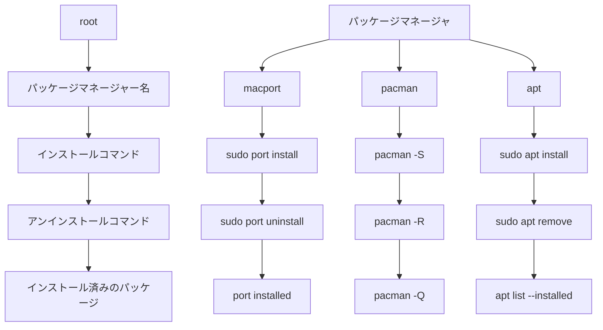

```mermaid
graph TD
    N[root] --> O[パッケージマネージャー名]
    O --> P[インストールコマンド]
    P --> Q[アンインストールコマンド]
    Q --> R[インストール済みのパッケージ]

    A[パッケージマネージャ] --> B[macport]
    A --> C[pacman]
    A --> D[apt]

    B --> E[sudo port install]
    C --> F[pacman -S]
    D --> G[sudo apt install]

    E --> H[sudo port uninstall]
    F --> I[pacman -R]
    G --> J[sudo apt remove]

    H --> K[port installed]
    I --> L[pacman -Q]
    J --> M[apt list --installed]
```